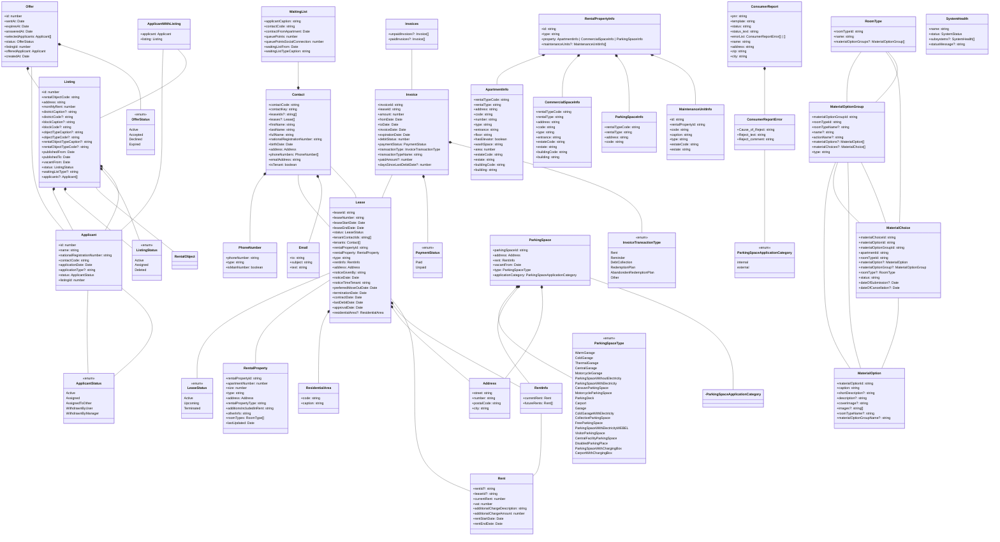

```mermaid
classDiagram

Offer *-- Listing
Offer -- Applicant
Offer *-- OfferStatus

Listing *-- Applicant
Listing *-- ListingStatus

Applicant -- ApplicantStatus

Contact *-- PhoneNumber
Contact -- Lease
Contact *-- Email

Lease -- LeaseStatus
Lease -- RentalProperty
Lease *-- ResidentialArea
Lease *-- Address
Lease -- Contact
Lease *-- RentInfo

RentInfo -- Rent

Rent -- Lease

RoomType -- MaterialOptionGroup

MaterialChoice -- MaterialOption
MaterialChoice -- MaterialOptionGroup
MaterialChoice -- RoomType

MaterialOptionGroup -- MaterialOption
MaterialOptionGroup -- MaterialChoice
MaterialOptionGroup -- RoomType

MaterialOption -- MaterialOptionGroup

ConsumerReport *-- ConsumerReportError

ConsumerReportError -- ParkingSpaceApplicationCategory

ParkingSpace *-- ParkingSpaceType
ParkingSpace *-- RentInfo
ParkingSpace *-- Address
ParkingSpace --- ParkingSpaceApplicationCategory

Invoices -- Invoice

Invoice -- Lease
Invoice *-- PaymentStatus
Invoice *-- InvoiceTransactionType

WaitingList --* Contact

Listing -- RentalObject
Listing *-- ListingStatus
Listing *-- Applicant

Applicant -- ApplicantStatus

ApplicantWithListing -- Applicant
ApplicantWithListing -- Listing

class LeaseStatus {
Active
Upcoming
Terminated
}
<<enum>> LeaseStatus

RentalPropertyInfo *-- ApartmentInfo
RentalPropertyInfo *-- CommercialSpaceInfo
RentalPropertyInfo *-- ParkingSpaceInfo
RentalPropertyInfo *-- MaintenanceUnitInfo

class ParkingSpaceType {
WarmGarage
ColdGarage
ThermalGarage
CentralGarage
MotorcycleGarage
ParkingSpaceWithoutElectricity
ParkingSpaceWithElectricity
CaravanParkingSpace
MotorcycleParkingSpace
ParkingDeck
Carport
Garage
ColdGarageWithElectricity
CollectiveParkingSpace
FreeParkingSpace
ParkingSpaceWithElectricityWEBEL
VisitorParkingSpace
CentralFacilityParkingSpace
DisabledParkingPlace
ParkingSpaceWithChargingBox
CarportWithChargingBox
}
<<enum>> ParkingSpaceType

class ParkingSpaceApplicationCategory {
internal
external
}
<<enum>> ParkingSpaceApplicationCategory

class InvoiceTransactionType {
Rent
Reminder
DebtCollection
RedemptionPlan
AbandondenRedemptionPlan
Other
}
<<enum>> InvoiceTransactionType

class PaymentStatus {
Paid
Unpaid
}
<<enum>> PaymentStatus

class ListingStatus {
Active
Assigned
Deleted
}
<<enum>> ListingStatus

class ApplicantStatus {
Active
Assigned
AssignedToOther
WithdrawnByUser
WithdrawnByManager
}
<<enum>> ApplicantStatus

class OfferStatus {
Active
Accepted
Declined
Expired
}
<<enum>> OfferStatus

class Contact {
+contactCode: string
+contactKey: string
+leaseIds?: string[]
+leases?: Lease[]
+firstName: string
+lastName: string
+fullName: string
+nationalRegistrationNumber: string
+birthDate: Date
+address: Address
+phoneNumbers: PhoneNumber[]
+emailAddress: string
+isTenant: boolean
}

class PhoneNumber {
+phoneNumber: string
+type: string
+isMainNumber: boolean
}

class Lease {
+leaseId: string
+leaseNumber: string
+leaseStartDate: Date
+leaseEndDate: Date
+status: LeaseStatus
+tenantContactIds: string[]
+tenants: Contact[]
+rentalPropertyId: string
+rentalProperty: RentalProperty
+type: string
+rentInfo: RentInfo
+address: Address
+noticeGivenBy: string
+noticeDate: Date
+noticeTimeTenant: string
+preferredMoveOutDate: Date
+terminationDate: Date
+contractDate: Date
+lastDebitDate: Date
+approvalDate: Date
+residentialArea?: ResidentialArea
}

class ResidentialArea {
+code: string
+caption: string
}

class RentalProperty {
+rentalPropertyId: string
+apartmentNumber: number
+size: number
+type: string
+address: Address
+rentalPropertyType: string
+additionsIncludedInRent: string
+otherInfo: string
+roomTypes: RoomType[]
+lastUpdated: Date
}

class Address {
+street: string
+number: string
+postalCode: string
+city: string
}

class RentInfo {
+currentRent: Rent
+futureRents: Rent[]
}

class Rent {
+rentId?: string
+leaseId?: string
+currentRent: number
+vat: number
+additionalChargeDescription: string
+additionalChargeAmount: number
+rentStartDate: Date
+rentEndDate: Date
}

class RoomType {
+roomTypeId: string
+name: string
+materialOptionGroups?: MaterialOptionGroup[]
}

class MaterialChoice {
+materialChoiceId: string
+materialOptionId: string
+materialOptionGroupId: string
+apartmentId: string
+roomTypeId: string
+materialOption?: MaterialOption
+materialOptionGroup?: MaterialOptionGroup
+roomType?: RoomType
+status: string
+dateOfSubmission?: Date
+dateOfCancellation?: Date
}

class MaterialOptionGroup {
+materialOptionGroupId: string
+roomTypeId: string
+roomTypeName?: string
+name?: string
+actionName?: string
+materialOptions?: MaterialOption[]
+materialChoices?: MaterialChoice[]
+type: string
}

class MaterialOption {
+materialOptionId: string
+caption: string
+shortDescription?: string
+description?: string
+coverImage?: string
+images?: string[]
+roomTypeName?: string
+materialOptionGroupName?: string
}

class ConsumerReport {
+pnr: string
+template: string
+status: string
+status_text: string
+errorList: ConsumerReportError[] | []
+name: string
+address: string
+zip: string
+city: string
}

class ConsumerReportError {
+Cause_of_Reject: string
+Reject_text: string
+Reject_comment: string
}

class ParkingSpace {
+parkingSpaceId: string
+address: Address
+rent: RentInfo
+vacantFrom: Date
+type: ParkingSpaceType
+applicationCategory: ParkingSpaceApplicationCategory
}

class Email {
+to: string
+subject: string
+text: string
}

class Invoices {
+unpaidInvoices?: Invoice[]
+paidInvoices?: Invoice[]
}

class Invoice {
+invoiceId: string
+leaseId: string
+amount: number
+fromDate: Date
+toDate: Date
+invoiceDate: Date
+expirationDate: Date
+debitStatus: number
+paymentStatus: PaymentStatus
+transactionType: InvoiceTransactionType
+transactionTypeName: string
+paidAmount?: number
+daysSinceLastDebitDate?: number
}

class WaitingList {
+applicantCaption: string
+contactCode: string
+contractFromApartment: Date
+queuePoints: number
+queuePointsSocialConnection: number
+waitingListFrom: Date
+waitingListTypeCaption: string
}

class Listing {
+id: number
+rentalObjectCode: string
+address: string
+monthlyRent: number
+districtCaption?: string
+districtCode?: string
+blockCaption?: string
+blockCode?: string
+objectTypeCaption?: string
+objectTypeCode?: string
+rentalObjectTypeCaption?: string
+rentalObjectTypeCode?: string
+publishedFrom: Date
+publishedTo: Date
+vacantFrom: Date
+status: ListingStatus
+waitingListType?: string
+applicants?: Applicant[]
}

class Applicant {
+id: number
+name: string
+nationalRegistrationNumber: string
+contactCode: string
+applicationDate: Date
+applicationType?: string
+status: ApplicantStatus
+listingId: number
}

class Offer {
+id: number
+sentAt: Date
+expiresAt: Date
+answeredAt: Date
+selectedApplicants: Applicant[]
+status: OfferStatus
+listingId: number
+offeredApplicant: Applicant
+createdAt: Date
}

class ApplicantWithListing {
+applicant: Applicant
+listing: Listing
}

class RentalPropertyInfo {
+id: string
+type: string
+property: ApartmentInfo | CommercialSpaceInfo | ParkingSpaceInfo
+maintenanceUnits?: MaintenanceUnitInfo[]
}

class ApartmentInfo {
+rentalTypeCode: string
+rentalType: string
+address: string
+code: string
+number: string
+type: string
+entrance: string
+floor: string
+hasElevator: boolean
+washSpace: string
+area: number
+estateCode: string
+estate: string
+buildingCode: string
+building: string
}

class CommercialSpaceInfo {
+rentalTypeCode: string
+rentalType: string
+address: string
+code: string
+type: string
+entrance: string
+estateCode: string
+estate: string
+buildingCode: string
+building: string
}

class ParkingSpaceInfo {
+rentalTypeCode: string
+rentalType: string
+address: string
+code: string
}

class MaintenanceUnitInfo {
+id: string
+rentalPropertyId: string
+code: string
+caption: string
+type: string
+estateCode: string
+estate: string
}

class SystemHealth {
+name: string
+status: SystemStatus
+subsystems?: SystemHealth[]
+statusMessage?: string
}

```
